 
 

 

### About

I build software products from the first idea to a working release. AI is my primary implementation tool — I own the **problem definition**, **specification**, **architecture**, **decisions**, and **testing**, and use AI to move from spec to shipped code faster.

Most of my projects start from a problem I run into myself and grow into complete, everyday tools: AI workspaces, study and health trackers, desktop utilities, and automation.

 

### Selected work

  
  
  
  
  
  

 

### Utilities

| Project | Description |
| :--- | :--- |
| [**AI Exporters**](https://github.com/riique/AI_Exporters) | Exports Claude, Grok, and ChatGPT conversations to JSON or Markdown. |
| [**MutualCheck**](https://github.com/riique/MutualCheck) | Compares Following and Followers on X without handing your account to a third-party service. |
| [**InstagramReelsSpeed**](https://github.com/riique/InstagramReelsSpeed) | Userscript that adds playback speed controls to Instagram Reels. |
| [**HaumeaMC**](https://github.com/riique/HaumeaMC) | Minecraft KitPvP and lobby plugin. Related plugins: [LastDeath](https://github.com/riique/LastDeath), [PingCheck](https://github.com/riique/PingCheck), [NoAracnophobia](https://github.com/riique/NoAracnophobia). |
| [**AprendizadoAntigo**](https://github.com/riique/AprendizadoAntigo) | Archive of my early programming exercises. |

 

### Approach

  

 

### Toolkit

  
  
  
  
  
  
   
  
  
  
  
  
  
   
  
  
  
  
  

 

### Activity

  
  

<picture>
  <source media="(prefers-color-scheme: dark)" srcset="https://raw.githubusercontent.com/riique/riique/output/github-snake-dark.svg?v=3">
  
</picture>

 
 

