 

 

## ✦ about

I build tools for problems that annoy me, ideas that sound interesting, and projects that probably started with:

> *“Could this be done?”*

Every project on this profile is **vibe-coded**.
AI is my main implementation tool; I handle the **idea**, the **specification**, the **architecture**, the **decisions**, the **tests**, the **iterations**, and the part where I ask:

> *“Now fix this without breaking everything else.”*

The original scope usually does not survive the first prompt.

 

## ✦ main projects

Some started with “real quick.” **“Real quick” is a product estimate, not a time estimate.**

  
  
  
  
  
  

## ✦ side quests & utilities

Smaller things. Some of them even respected the original scope.

| | Project | What it does |
| :---: | :--- | :--- |
| 📤 | **[AI Exporters](https://github.com/riique/AI_Exporters)** | Exports Claude, Grok, and ChatGPT conversations to JSON or Markdown. |
| 🔁 | **[MutualCheck](https://github.com/riique/MutualCheck)** | Compares Following and Followers on X without handing your account to another service. |
| ⏩ | **[InstagramReelsSpeed](https://github.com/riique/InstagramReelsSpeed)** | Adds playback speed controls to Reels through a userscript. |
| ⛏️ | **[HaumeaMC](https://github.com/riique/HaumeaMC)** | A Minecraft KitPvP and lobby plugin; the smaller ones live in [LastDeath](https://github.com/riique/LastDeath), [PingCheck](https://github.com/riique/PingCheck), and [NoAracnophobia](https://github.com/riique/NoAracnophobia). |
| 🦴 | **[AprendizadoAntigo](https://github.com/riique/AprendizadoAntigo)** | My code dig site, from when centering a div was still a boss fight. |

 

## ✦ stack used in the experiments

  

<i>I do not claim to master all of them. I claim to have convinced each of them to cooperate at least once.</i>

 

## ✦ token-maxxing pipeline

  <strong>My goal is to maximize product per token.</strong>
   
  So far, I have mostly achieved tokens per product.

  

<i>The cycle ends when the product is finished — or when the context runs out.</i>

## ✦ token maxxing department

  

 

## ✦ GitHub activity

  <picture>
    <source media="(prefers-color-scheme: dark)" srcset="https://github-readme-stats-plus.vercel.app/api?username=riique&amp;show_icons=true&amp;count_private=true&amp;include_all_commits=true&amp;hide_rank=true&amp;hide_border=true&amp;disable_animations=true&amp;bg_color=00000000&amp;title_color=a855f7&amp;icon_color=a855f7&amp;text_color=c9d1d9">
    
  </picture>
  <picture>
    <source media="(prefers-color-scheme: dark)" srcset="https://github-readme-stats-plus.vercel.app/api/top-langs/?username=riique&amp;layout=compact&amp;langs_count=8&amp;hide_border=true&amp;disable_animations=true&amp;bg_color=00000000&amp;title_color=a855f7&amp;text_color=c9d1d9">
    
  </picture>

<picture>
  <source media="(prefers-color-scheme: dark)" srcset="https://raw.githubusercontent.com/riique/riique/output/github-snake-dark.svg?v=2">
  
</picture>

 
 

